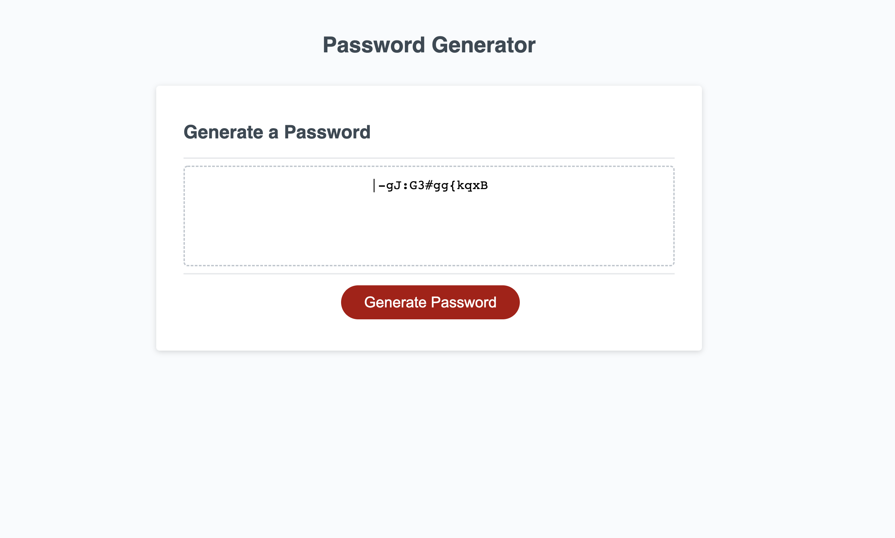

# code-quiz
Git Hub: https://github.com/Lexi-Diamond/password-generator.git
Live URL:  https://lexi-diamond.github.io/password-generator/

Screenshot
;

This project is a password generator. 
When the user clicks generate password they are presented with a pop up window that asks them a serries of questions:
    -Length of Password
    -If they want to use special characters-
    -If they want to use capitol lettes-
    -If they want to use lowercase letters-
    -If they want to use numbers.
The user must confirm at least one option of the following; capitol letters, lowercase letters, numbers.
If the user does not confirm at least one option the pop up window will inform them that they need to choose at least one. 
Once the user selects all prompts the password is generated and displayed in the password line. 
